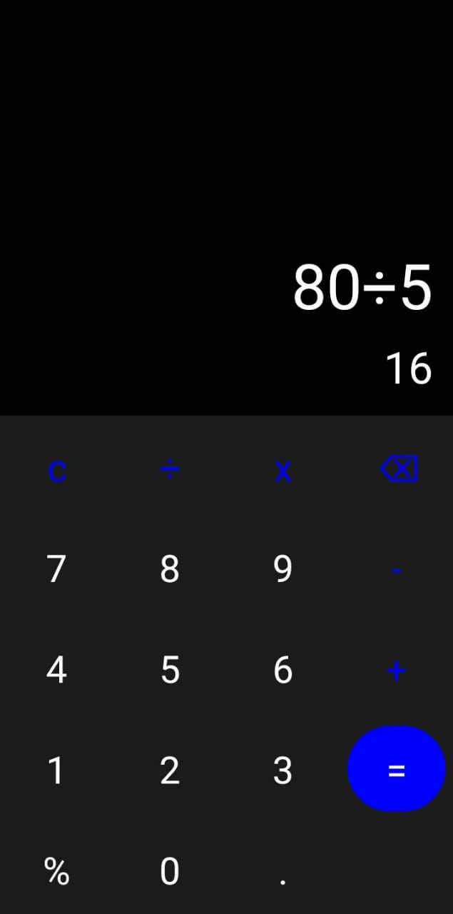

# Kotlin Calculator

An Android calculator application built with Kotlin and Jetpack Compose.

This project was developed as a practical Android development project while learning Kotlin, Jetpack Compose, user interface design, and application state management.

## Screenshot



## Features

- Addition
- Subtraction
- Multiplication
- Division
- Percentage support
- Decimal number support
- Clear button
- Backspace functionality
- Expression and result display
- Error handling for invalid expressions

## Technologies Used

- Kotlin
- Jetpack Compose
- Material 3
- Android SDK
- Gradle
- exp4j


## How to Run the Project

1. Clone this repository:

```bash
git clone https://github.com/IfunanyaOmeobi/kotlin-calculator.git
```

2. Open the project in Android Studio.

3. Allow Gradle to sync and download the required dependencies.

4. Run the application on an Android emulator or a connected Android device.

## Learning Outcomes

Through this project, I gained practical experience with:

- Kotlin programming
- Building Android user interfaces with Jetpack Compose
- Handling user input and button interactions
- Working with Android Studio and Gradle
- Using Git and GitHub for version control
